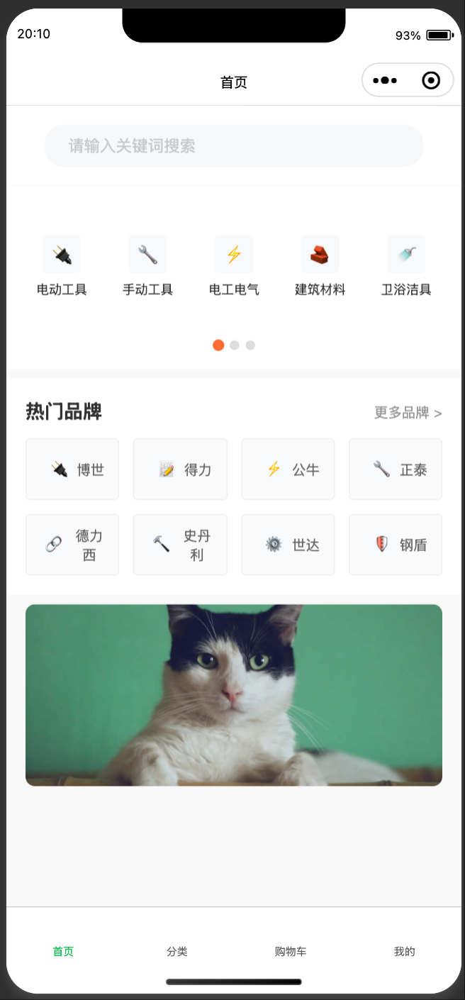
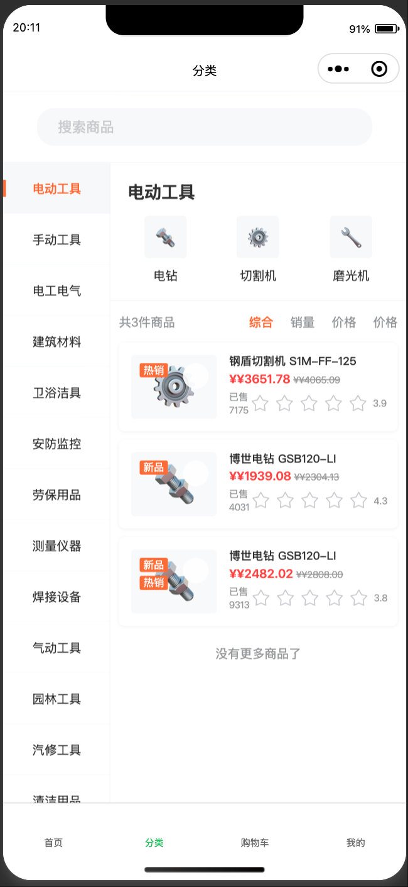
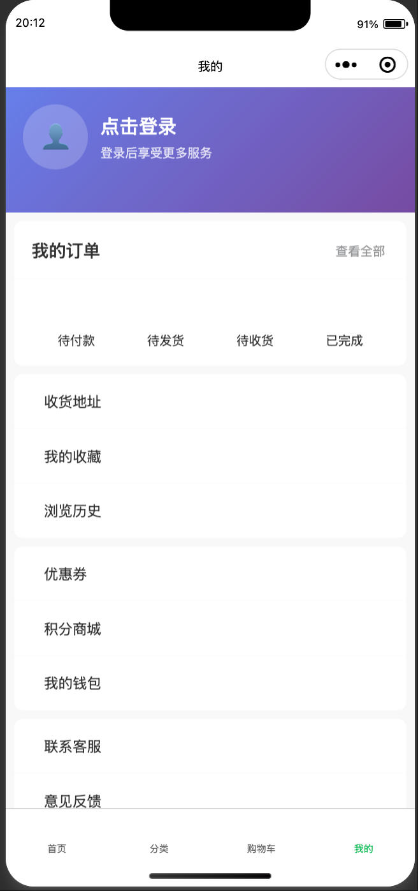

### **五金机电一站式采购商城小程序解决方案（V1.0）**

**文档状态**：供评审

**项目发起方**：[]

**方案提供方**：[]

**日期**：[2025 年 8 月 31 日]

---

#### **一、 项目概述与愿景**

**1.1 项目背景**
为顺应数字化采购趋势，提升[]在五金机电领域的服务效率与客户体验，特规划本小程序商城项目。旨在打造一个专业、便捷、可信赖的线上采购平台，让企业客户与个人消费者能够随时随地浏览海量商品、了解品牌促销、高效完成采购，最终提升客户粘性与销售额。

**1.2 设计理念**
以“**专业分类、品牌导向、体验至上**”为核心设计理念。参考行业领先平台（如“天天达”）的交互逻辑，结合五金机电产品特性（SKU 多、参数复杂、品牌效应强），进行个性化设计，确保用户能快速找到所需商品。

**1.3 分期规划（模块化实施路线图）**
为最大化灵活性，本项目采用**模块化实施**方案。甲方可优先启动核心模块（第一期），随后根据运营情况，选择性启用增强模块（第二期及以后）。

#### **二、 功能模块详述（可裁剪套餐）**

**2.1 小程序前端功能模块（增强版）**

| 大模块          | 子功能         | 详细描述                                                                                                                                                                                                                                                                                         | 优先级 |
| :-------------- | :------------- | :----------------------------------------------------------------------------------------------------------------------------------------------------------------------------------------------------------------------------------------------------------------------------------------------- | :----- |
| **1. 首页**     | 1.1 智能搜索   | **增强：** 支持**历史搜索记录**、**搜索提示补全**、**热门搜索关键词**。                                                                                                                                                                                                                          | 高     |
|                 | 1.2 分类导航   | 顶部 Swiper 滚动+左侧全部分类入口，支持二级、三级分类。                                                                                                                                                                                                                                          | 高     |
|                 | 1.3 品牌旗舰区 | 品牌 LOGO 墙，支持按首字母筛选品牌。可配置为“品牌专场”。                                                                                                                                                                                                                                         | 高     |
|                 | 1.4 促销活动   | 支持配置多个 Banner，可链接到**活动页**或**特定商品**。                                                                                                                                                                                                                                          | 高     |
|                 | 1.5 常购清单   | **新增：** 针对企业客户，可设置常用采购商品清单，一键快速加购。                                                                                                                                                                                                                                  | 中     |
|                 | 1.6 推荐专区   | **新增：** 基于热门销量或人工配置的“热门采购”、“猜你喜欢”板块。                                                                                                                                                                                                                                  | 中     |
| **2. 商品**     | 2.1 分类页     | **增强：** 强大的**筛选器**：按品牌、价格区间、参数（如电压、规格）、是否有货等。                                                                                                                                                                                                                | 高     |
|                 | 2.2 商品列表   | 支持综合排序、销量排序、价格排序。显示商品最低价起。                                                                                                                                                                                                                                             | 高     |
|                 | 2.3 商品详情页 | **增强：**   - **多规格选择**：清晰展示不同规格（如长度、颜色、型号）对应的价格、库存。  - **参数表**：以表格形式展示专业参数，清晰易懂。  - **商品详情图文**：支持长图文、视频详细介绍。  - **购买咨询**：集成微信客服，一键联系。  - **分享功能**：可分享商品给微信好友或群聊。 | 高     |
|                 | 2.4 品牌馆     | **新增：** 聚合该品牌下所有商品，展示品牌故事、资质证书，增强品牌信任度。                                                                                                                                                                                                                        | 中     |
| **3. 购物车**   | 3.1 商品管理   | **（二期功能）** 增、删、改数量，实时计算总价。                                                                                                                                                                                                                                                  | 高     |
|                 | 3.2 优惠计算   | **（二期功能）** 自动计算活动优惠、满减，清晰展示优惠明细。                                                                                                                                                                                                                                      | 高     |
|                 | 3.3 库存提醒   | **（二期功能）** 商品库存不足或发生变化时，实时提示用户。                                                                                                                                                                                                                                        | 中     |
| **4. 个人中心** | 4.1 我的收藏   | 商品收藏列表，支持分类查看和移除。                                                                                                                                                                                                                                                               | 高     |
|                 | 4.2 我的地址   | **（二期功能）** 多收货地址管理。                                                                                                                                                                                                                                                                | 高     |
|                 | 4.3 我的订单   | **（二期功能）** 查看所有订单状态（待付款、待发货、待收货、已完成），支持订单详情查看、付款、取消、确认收货、申请售后。                                                                                                                                                                          | 高     |
|                 | 4.4 客服中心   | **新增：** 常见问题解答（FAQ）、直接联系在线客服的入口。                                                                                                                                                                                                                                         | 中     |
|                 | 4.5 账号管理   | 绑定手机号、修改密码等功能。                                                                                                                                                                                                                                                                     | 高     |
|                 | 4.6 发票管理   | **新增（二期）：** 保存、管理公司的常用开票信息。                                                                                                                                                                                                                                                | 中     |
|                 | 4.7 报价单     | **新增：** 针对询价场景，用户可将商品加入报价单，线上联系客服获取批量报价。                                                                                                                                                                                                                      | 中     |

**2.2 管理后台功能模块（增强版）**

| 模块           | 功能点     | 详细描述                                                                                                                                | 优先级 |
| :------------- | :--------- | :-------------------------------------------------------------------------------------------------------------------------------------- | :----- |
| **商品中心**   | 商品管理   | **增强：** 支持批量导入/导出（Excel 模板）、批量删/改/上下架。**SKU（库存单位）管理**，可针对同一商品设置不同规格及其价格、库存、图片。 | 高     |
|                | 分类管理   | 支持无限层级分类，可设置分类图片、图标。                                                                                                | 高     |
|                | 品牌管理   | 维护品牌信息、Logo、简介。                                                                                                              | 高     |
|                | 参数管理   | **新增：** 可定义全局商品参数（如“额定电压”、“线径”），并在添加商品时选择，保证数据规范性。                                             | 高     |
| **订单中心**   | 订单管理   | **（二期功能）** 查看所有订单，处理发货、退款、打印面单等。                                                                             | 高     |
|                | 支付与账期 | **（二期功能）** 管理支付设置。**新增：** 可为信任的企业客户设置**账期**（月结）。                                                      | 低     |
| **用户与权限** | 用户管理   | 查看 C 端用户列表、注册来源、消费能力分层。                                                                                             | 高     |
|                | 客户管理   | **新增：** **企业客户认证**。企业员工提交资料认证后，可看到专属的企业价格或优惠。                                                       | 中     |
|                | 管理员权限 | 可创建不同角色的后台账号（如运营、客服），并分配不同操作权限。                                                                          | 高     |
| **营销中心**   | 广告位管理 | 灵活配置首页 Banner、弹窗广告等，可设置跳转链接和生效时间。                                                                             | 高     |
|                | 优惠券     | **（二期功能）** 创建和管理优惠券（满减券、折扣券），指定领取范围和使用范围。                                                           | 中     |
| **内容与数据** | 数据看板   | **新增：** 可视化图表展示核心数据：UV/PV、商品收藏排行、用户活跃度、销售额（二期）等。                                                  | 中     |
|                | 操作日志   | 记录所有后台操作，便于审计和追踪。                                                                                                      | 中     |

---

#### **三、 核心业务流程（Mermaid 图示）**

**3.1 第一期核心用户旅程（浏览-搜索-收藏）**

**3.2 第二期核心用户旅程（完整购物流程）**

---

#### **四、 技术方案概述（增强版）**

- **前端**：微信小程序原生框架，使用 WeUI 或 Vant Weapp 等组件库保证 UI 一致性。
- **后端**：
  - **语言**：Go 或 Node.js (Egg.js/Nest.js)，提供稳定高效的 API。
  - **架构**：清晰的 MVC 或 领域驱动设计（DDD）分层，便于后期维护和扩展。
  - **API**：遵循 Restful 设计规范，接口文档使用 Swagger 自动生成。
- **数据库**：
  - **主库**：MySQL 存储业务关系型数据。
  - **缓存**：Redis，用于缓存热点数据（如商品信息、 session）、提升性能。
- **云服务与部署**：
  - **云平台**：腾讯云/阿里云。
  - **对象存储**：COS/OSS，用于存储大量商品图片和静态资源。
  - **部署**：使用 Docker 容器化部署，配合 CI/CD（Jenkins/Git Actions）实现自动化发布。
  - **监控**：集成日志服务（ELK）和应用性能管理（APM）工具，保障系统稳定。

---

#### **五、 报价与实施建议**

**5.1 实施策略**
我们强烈建议采用 **“总体规划，分步实施，敏捷开发”** 的策略。

1.  **第一阶段（MVP 最小可行产品）**：开发首页、分类、搜索、商品详情、收藏、个人中心及基础后台。**（约 4-5 周）**
2.  **第二阶段（交易闭环）**：开发购物车、订单、支付、售后模块。**（约 3-4 周）**
3.  **第三阶段（增强与扩展）**：根据运营数据，选择性开发营销工具、企业认证、数据看板等高级功能。

**5.2 报价方式**
我们将根据您最终确定的**功能模块清单**，提供一份精确的**固定总价报价**。第一期开发完成后，第二、三阶段的开发将重新评估并签订补充协议。

我们期待与您深度沟通，为您量身定制最适合的数字化解决方案。
